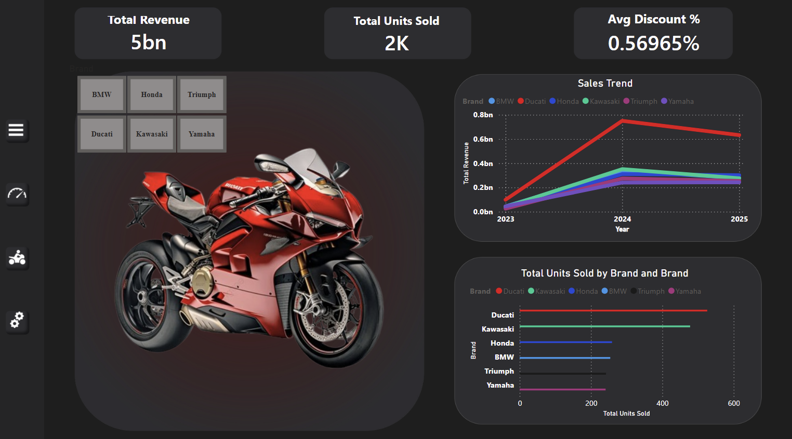
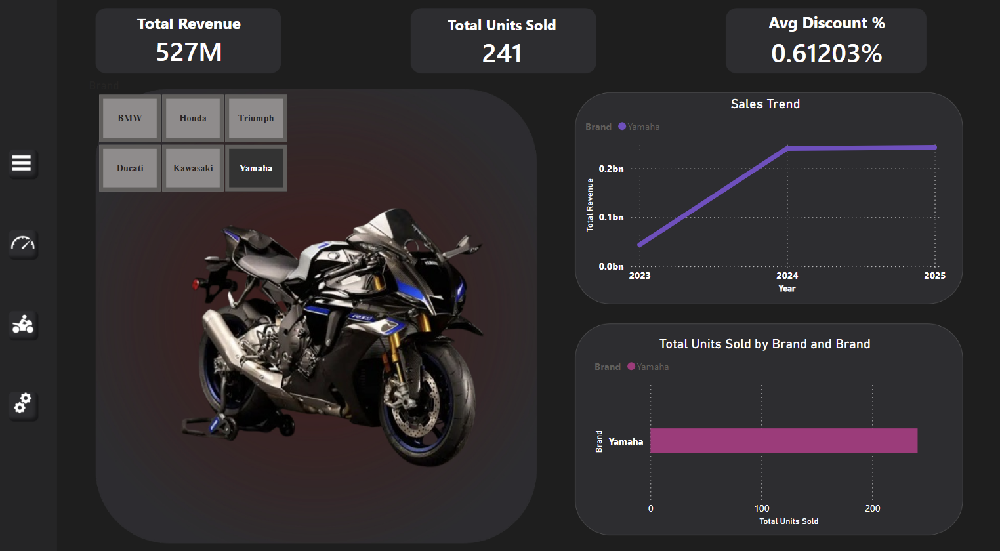
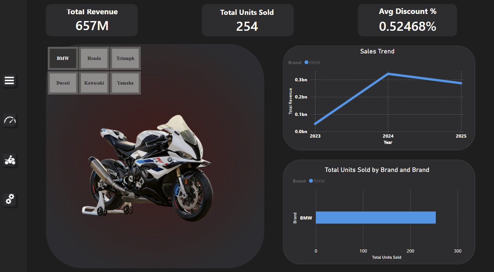
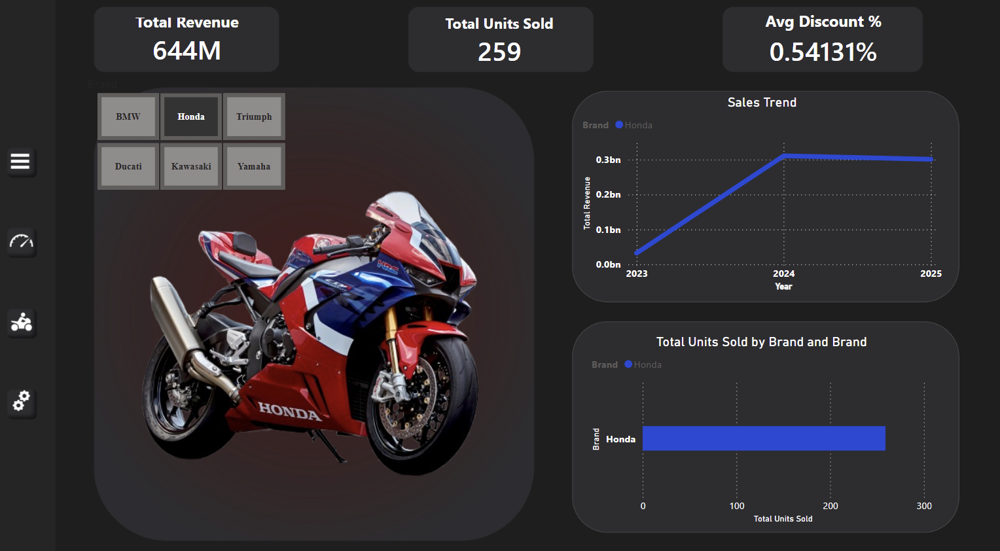
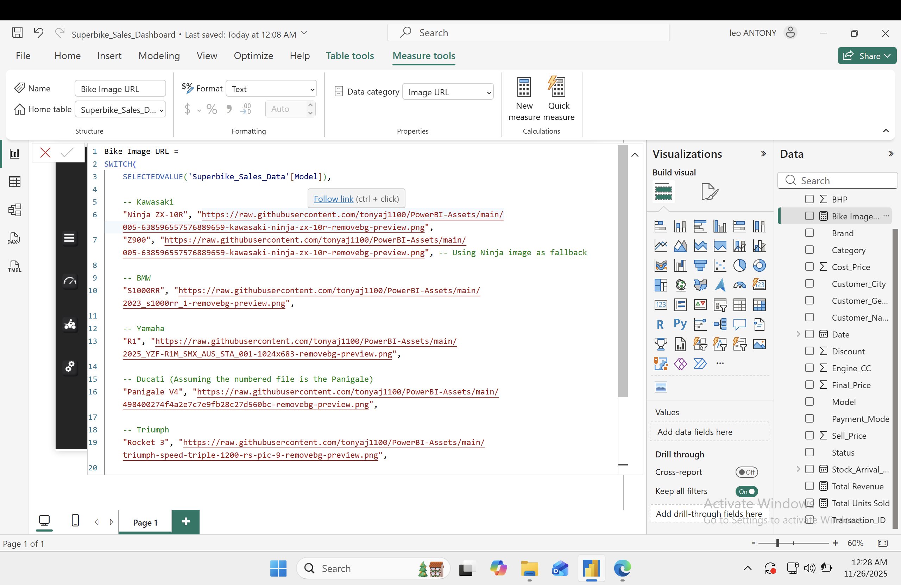

# 🏍️ Global Superbike Sales & Inventory Analysis



## 📄 Project Overview
This project is an advanced **Power BI** dashboard designed to analyze sales performance for a global superbike dealership. 

Unlike traditional corporate reports, this dashboard utilizes a **"Dark Mode" App-Style UI** to create an immersive experience. It allows stakeholders to interactively track **Revenue**, **Inventory Aging**, and **Brand Performance** for high-end machines like Ducati, BMW, and Kawasaki.

## 🎯 Business Problem
The dealership needed a unified view to answer key questions:
* **Profitability:** Which brands generate the highest revenue vs. volume?
* **Inventory Management:** How long are high-value assets (like the Panigale V4) sitting in the showroom?
* **Pricing Strategy:** What is the average discount given across different models?

## 🛠️ Tech Stack & Workflow
* **Power BI:** Data Visualization & Modeling.
* **DAX (Data Analysis Expressions):** Complex logic for dynamic image switching and time-intelligence calculations.
* **Power Query:** Data cleaning and transformation (ETL).
* **PowerPoint/Figma:** Designing the custom "Glassmorphism" background and layout.
* **GitHub:** Hosting transparent image assets to ensure high-performance rendering.

## 🌟 Key Features

### 1. Dynamic 3D Product Display
The core feature of this dashboard is the "Hero Section." Using advanced DAX logic, the dashboard dynamically fetches transparent 3D images from a cloud repository based on the user's selection.

**The DAX Logic used:**
```dax
Bike Image URL = 
SWITCH(
    SELECTEDVALUE('Superbike_Sales_Data'[Model]), 
    
    -- Kawasaki
    "Ninja ZX-10R", "https://raw.githubusercontent.com/tonyaj1100/PowerBI-Assets/main/005-638596557576889659-kawasaki-ninja-zx-10r-removebg-preview.png",
    "Z900", "https://raw.githubusercontent.com/tonyaj1100/PowerBI-Assets/main/005-638596557576889659-kawasaki-ninja-zx-10r-removebg-preview.png", -- Using Ninja image as fallback
    
    -- BMW
    "S1000RR", "https://raw.githubusercontent.com/tonyaj1100/PowerBI-Assets/main/2023_s1000rr_1-removebg-preview.png",
    
    -- Yamaha
    "R1", "https://raw.githubusercontent.com/tonyaj1100/PowerBI-Assets/main/2025_YZF-R1M_SMX_AUS_STA_001-1024x683-removebg-preview.png",
    
    -- Ducati (Assuming the numbered file is the Panigale)
    "Panigale V4", "https://raw.githubusercontent.com/tonyaj1100/PowerBI-Assets/main/498400274f4a2e7c7e9fb28c27d560bc-removebg-preview.png",
    
    -- Triumph
    "Rocket 3", "https://raw.githubusercontent.com/tonyaj1100/PowerBI-Assets/main/triumph-speed-triple-1200-rs-pic-9-removebg-preview.png",
    
    -- Honda (Assuming this file is the CBR)
    "CBR1000RR-R", "https://raw.githubusercontent.com/tonyaj1100/PowerBI-Assets/main/wp5254636-removebg-preview.png",
    
    -- Default Image (Shows Ducati if nothing selected)
    "https://raw.githubusercontent.com/tonyaj1100/PowerBI-Assets/main/498400274f4a2e7c7e9fb28c27d560bc-removebg-preview.png"
)
```

### 2. Custom "Glassmorphism" UI
Instead of standard Power BI visuals, I designed a custom background with a **Red Spotlight** aesthetic to match the premium nature of the products.
* **Design Tool:** PowerPoint
* **Technique:** Radial Gradients & Semi-Transparent Containers (Glassmorphism).
* **Implementation:** The background was exported as a high-resolution PNG and imported into Power BI with 0% transparency, creating a "Stage" for the data.

### 3. Sales & Inventory Intelligence
* **KPI Tickers:** Immediate view of Total Revenue, Units Sold, and Avg Discount %.
* **Trend Analysis:** Area charts showing sales velocity over time.
* **Brand Dominance:** Conditional formatting highlights the top-performing brand (e.g., Kawasaki) in Red, while others remain neutral to guide the user's eye.

## 📸 Project Snapshots

### Dynamic Filtering in Action
*When a user selects "Yamaha", the image and metrics update instantly.*


*When a user selects "BMW", the image and metrics update instantly.*


*When a user selects "Honda", the image and metrics update instantly.*


### The Logic Behind the Scene
*A look at the Data Model and Measure calculations.*


## 🚀 How to Run This Project
1. Download the `Superbike_Sales_Dashboard.pbix` file from this repository.
2. Open it in **Power BI Desktop**.
3. **Note:** Ensure you have an internet connection so the dynamic images can load from the GitHub repository.

---
